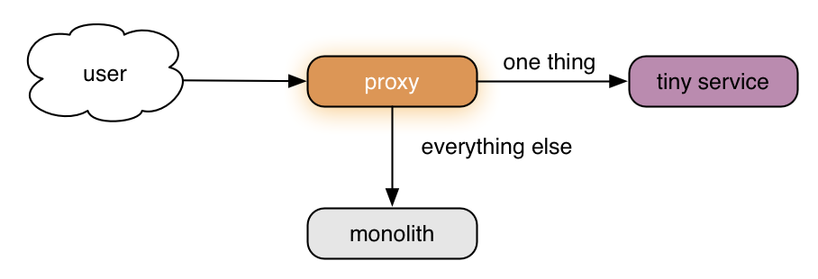
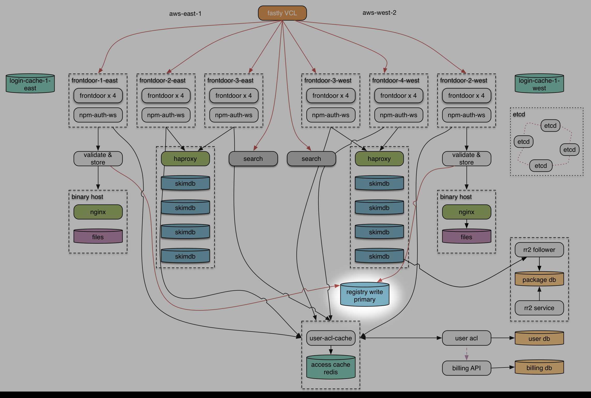

build-lists: true

# [fit] Cheating Gall's Law

---

# [fit] C J Silverio
## [fit] director of engineering, 

## [fit] @ceejbot

^ How many of you have ever used npm to install something? How many of you use it daily? The story I'm about to tell will be very relevant to you both because the work we did affected you & because the technique I'm about to describe will be helpful.

---

# [fit] Cheating Gall's Law
# [fit] How we split a
# [fit] monolith
# [fit] and lived to tell the tale

^ npm just finished a big rewrite of its registry service, a successful rewrite. this is such an unusual event in my career that I thought I'd talk a bit about why it's hard & how we did it. Let's start with Gall's Law.

---

# [fit] Gall's Law

# [fit] A complex system that works is
# [fit] invariably found to have evolved
# [fit] from a simple system that worked.

^ A complex system that works is invariably found to have evolved from a simple system that worked. Do you want to argue with this? His full statement is stronger.

---

# Gall's Law in full

> A complex system that works is invariably found to have evolved from a simple system that worked. A complex system designed from scratch never works and cannot be patched up to make it work. You have to start over with a working simple system.

^ A complex system that works is invariably found to have evolved from a simple system that worked. A complex system designed from scratch never works and cannot be patched up to make it work. You have to start over with a working simple system.

---

# [fit] "A simple system
# [fit] may or may not work."

^ That's really encouraging.

---

# [fit] Systemantics:
# [fit] How Systems Really Work
# [fit] and How They Fail

^ John Gall: a pediatrician. Interested in systems theory. This is the title of his big book, which is a darkly funny set of observations on systems of all kind. Insight: Systems operate in a constant state of failure. Gall is just a bundle of fun here. Let's apply this to software systems.

---

# [fit] starting simple
# [fit] often means starting with a
# [fit] monolith

---

^ Yay monoliths! What's a monolith besides something that has Richard Strauss accompanying it?

---

# [fit] monolith
# [fit] everything in one process

^ Slightly disparaging term for everything in one process. Really easy to write, often easy to deploy. Easy to think about. Easy to squish around as you're discovering what your app needs to be.

---

^ npm registry started with one of these!  

---

# [fit] npm's monolith:
# [fit] embedded in couchdb

^ npm registry 1.0: a monolith npm like a lot of systems was originally very simple. The registry was a few thousand lines of javascript embedded inside CouchDB. Auth was couch's auth. Package tarballs stored inside couch.

---

# [fit] monoliths
# [fit] work just fine

^ The registry was just fine as a couch app, using couch auth. When there were 10K modules, practically anything was going to work. This illustrates a general true thing: when you're small, just about everything works.

---

# [fit] whatever it takes
# [fit] to build a system
# [fit] that satisfies your users

^ When you start, your job is to make a thing people want to use. It's hard to make something that delights your users and is a viable product. You don't have a scaling problem. Then, if you're lucky, something terrible happens.

---

# [fit] success!
# [fit] now scale it.

^ Your next job is to SURVIVE the fact that people want to use it. You might recall the story of the early days of Twitter, when they built your timeline by querying mysql. Your first reaction is probably to make your monolith bigger, maybe the size of jupiter.

---

^ You're gonna need more monoliths.

---

# [fit] scaling monoliths
# [fit] many copies of the full thing

^ Scaling horizontally. You've got a single widget. You just make more copies of it & load balance among them. If your database can cope with that, you're in good shape for a while. But sometimes you *really* succeed.

---

^ Ever seen an exponential growth chart? This is one. Blue line packages. Red line monthly downloads. Joined at 150 million/month. Now it's 1.4 billion/month. 72 million dls peak last week.

---

# [fit] Exponential growth of node
# [fit] resulted in exponential growth
# [fit] of the npm registry

^ This is all of YOU using node to write web apps. This was node growing & the registry being good enough at making its users happy.

---

# [fit] exponential monoliths
# [fit] were going to be expensive

^ Also they were on fire. Had to scale some way other than making a lot of copies of our couchdb.

---

# [fit] splitting the
# [fit] monolith

^ You need to scale differently: you break up the monolith.

---

# [fit] yay microservices?

^ This is what everybody says. Not going to bludgeon you with yet another discussion of microservices & why you want them. Let's suppose you've decided to split things up.

---

# [fit] just rewrite everything!
# [fit] what's the problem?

^ Just rewrite it all in a million tiny pieces! no problem!

---

# [fit] Your monolith is complex.
# [fit] A split system is more complex.

^ Complexity is the enemy of everything.

---

# [fit] what did that Gall guy say about
# [fit] complex working systems?

^ Didn't we just hear something about complex systems? Your target for a rewrite is the full complicated thing that's running in production today, not the simple thing you started with. Famous problem: second system syndrome. Gall also said this

---

# [fit] "If a system is working,
# [fit] leave it alone.
# [fit] Don't change anything."

^ Doom and gloom! Oh crap!

---

# [fit] Gall's Law
# [fit] warns us about
# [fit] that rewrite

^ The system we need to replicate is complicated. We can't just build it from scratch. Most of the attempts to do this that I've seen in my career have ended badly. second system syndrome.

---

# [fit] how do you split
# [fit] a monolith
# [fit] successfully?

^ so how? npm is not on fire today, so obviously there's a way.

---

# [fit] Let's cheat.

^ I promised you we'd be cheating. You can't break the law, no matter how tempted you are to argue with it. You have to write simple working systems first.

---

# [fit] Q: How do you cheat?
# [fit] A: By not rewriting the whole thing.

^ There are a lot of options here. I'm going to tell you the one npm took, because it's a networked service. If you're writing web services, this might work for you.

---

# [fit] slice off a part of the system
# [fit] into a module
# [fit] with a clearly-defined interface

^ Some part of your system, some feature, can be thought of as a module. Maybe it even is a module inside the monolith.

---

# [fit] then write a
# [fit] second implementation
# [fit] of that interface

^ This time standalone, outside the monolith.

---

# [fit] send requests to that
# [fit] second implementation
# [fit] with a proxy

^ Proxies let you divide & conquer.

---

^ For you visual thinkers, here's this incredibly simple approach. Let's look at an example.

---

^ Here's npm's monolith pre-split. Now watch what we do.

---

^ go to next

---

^ Varnish as a proxy: tarball reads go to nginx. Package metadata reads & writes go to couchdb. This simple technique was our first step to breaking up the monolith. This one change relieved about 90% of our couchdb performance problems.

---

# [fit] now let's make our proxy smart
# [fit] Replace Varnish
# [fit] with a node service

^ You can put some logic into Varnish, but get a lot more mileage out of proxying at the application level. Way more control & awareness. We used node. You can use whatever you want.

---

^ go to next

---

^ We called it the registry frontdoor, because all traffic goes through it. You'll notice that it's doing nothing right now.

---

# [fit] first step
# [fit] just send everything through

^ Don't try to do anything! Just send traffic thru.

---

# [fit] record what the proxy does
# [fit] how do people use your service?
# [fit] measure performance

^ Log everything, count everything, generate metrics for everything. This is especially awesome if you're looking at a big legacy system that nobody understands any more. This also lets you identify your hot spots so you can isolate them.

---

# [fit] second step
# [fit] divide & conquer

^ Now that you have data & know what's most on fire, replace a piece of your monolith. Don't rewrite the whole thing. Rewrite a simple piece.  Here's what our next steps looked like.

---

^ go to next

---

^ Authorization & package validation are now pulled out of couch into services. Woah, we just rewrote two things.

---

# [fit] beat Gall's Law with
# [fit] modularity
# [fit] aka information hiding

^ You think about this at the code level, but here we're doing it at the service level. The implementation of each module is hidden behind the API of the service.

---

# [fit] each service is a module
# [fit] a simple, testable system
# [fit] when viewed in isolation

^ Gall's Law is still in force. We still must write simple things & build from there. In this case, the new simple system is the new service. The existing working system evolved slightly to be more complex.

---

# [fit] best part:
# [fit] now you can change
# [fit] everything

^ I told you I wasn't going to sell microservices, but I'm selling them. This is for me the neatest part.

---

# [fit] your platform
# [fit] your database

^ We went from js inside couchdb to js in node services. Also changed how we stored our data.

---

---

^ We also changed how we were storing data: we pulled data out of couchdb onto the file system and into postgres.

---

# [fit] why stop there?

---

^ The real system diagram looks like this, but most of the time I don't need to think about it at this level. (If you want the details here, come to NodeConf OneShot on Saturday.)

---

^ Notice something here? It's our original monolith, still there, chugging along. What it does is reduced to the things couchdb is fantastic at: storing json blobs & replicating the data to the rest of our system.

---

# [fit] the awesome

^ Let's talk good parts & bad parts.

---

# [fit] Each piece is a
# [fit] simple system

^ Gall's Law says this is a prereq for things working at all. More easily debugged & understood. You can understand it, develop it, & test it.

---

# [fit] more scaling dials to turn
# [fit] finer-grained perf data

^ Metrics & logging. Can scale by multiplication of a smaller piece. For us this was a huge win. SEARCH. CouchDB was sweating.

---

# [fit] isolating tasks
# [fit] let us debug
# [fit] even without splitting the monolith

^ Load on any one part can be characterized, because you've separated it. This was our biggest win: we identified the hot spots this way. First we discovered that serving tarballs was making couchdb melt. Later on we split out cli search & observed it was a disaster. We rewrote it recently.

---

# [fit] the system overall is complex
# [fit] but loosely coupled

^ Changes can still be understood. Changes are isolated.

---

# [fit] you have a working system
# [fit] every step of the way

^ This approach is much safer than a total rewrite. You can test each piece separately. This system is getting steadily more complex, but that's okay. You're evolving a working system.

---

# [fit] a proxy service lets you
# [fit] flip back & forth
# [fit] between implementations

^ You can test your assumptions. Send a portion of traffic through & load test. Flip back if you've got bugs. Proxy is a facade in the design patterns sense.

---

# [fit] the not awesome

^ There's always a tradeoff. Nothing ever comes free.

---

# [fit] now you've got a
# [fit] distributed system

^ You had one before but mostly you pretended you didn't because the hard parts were handled by somebody else. Now you have one that's entirely your responsibilty. We had race conditions. We are slightly less stable than we were before the final step.

---

# @architectclippy says

> I see you have a poorly structured monolith. Would you like me to convert it into a poorly structured set of microservices?

^ Cannot save you from poor decisions about modularity. If you haven't figured out how to hide information, you're still in trouble.

---

# [fit] Second system syndrome
# [fit] "this time we'll do it right"

^ Doing it right usually means generalizing EVERYTHING because you just went through the pain of adding generalization here & there to a system that wasn't designed for it. Don't do it!

---

# [fit] Generalize only
# [fit] when forced

^ Even when you remember the pain you experienced generalizing that first system. Do it only when you must. Avoid complexity that doesn't pay for itself.

---

# [fit] let's recap!
# [fit] how do you survive a rewrite?

^ This approach won't always be what you need, but it is fantastic when you do. Put it into your back pocket and pull it out whenever you're looking at a rewrite.

---

# [fit] simple working service first
# [fit] scale it later

^ Don't be ridiculous about scaling, but don't worry about it. You'll be able to afford it later if you've built something people want. Be ruthless about this.

---

# [fit] respect Gall:
# [fit] rewrite in pieces

^ Avoid complexity of a full rewrite by rewriting small parts. Modularity!

---

# [fit] use a proxy
# [fit] to divide & conquer

^ Put a proxy on it. A proxy will let you divide & conquer. Proxies are cool. Like fezzes. I'm into proxies now.

---

# [fit] Be bold
# [fit] you can change your system

^ I've also seen needed rewrites never even start because of fear. I cannot help you with the politics, but I can tell you that you don't have to be afraid. You can change one small piece of a system at a time. This approach works.

---

# [fit] Nobody noticed
# [fit] when we changed
# [fit] the entire npm registry

^ 120 seconds of downtime during the rollout because two humans failed to communicate about something. If I can do it, you can do it.

---

# [fit]  loves you
# [fit] `npm install -g npm@latest`

^ Got questions? Ask me for details at the panel. Or ask Maciej.
