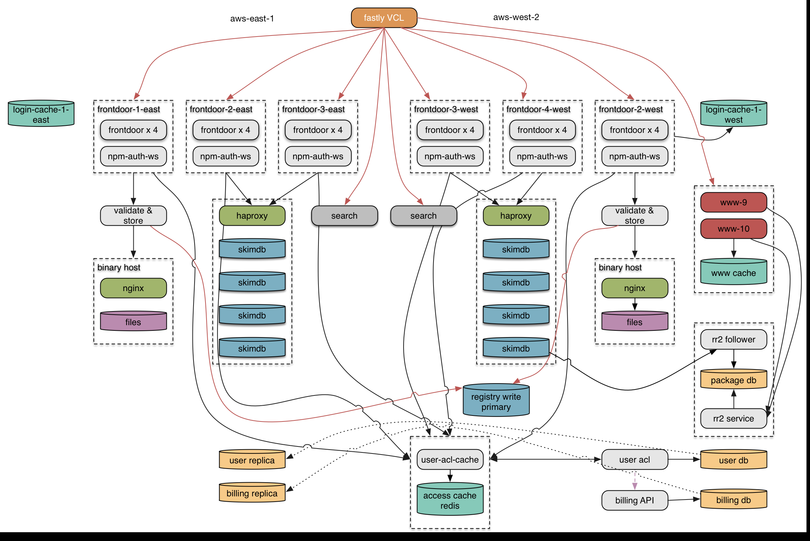

build-lists: true
# [fit] npm registry
# [fit] dev-ops deep-dive

---

# [fit] C J Silverio
## [fit] director of engineering, npm
## [fit] @ceejbot

^ In case you forgot who I am: this is who I am this year. Next year I might be somebody else. YNK.

---

# [fit] registry 1.0
# [fit] embedded in couchdb

^ Here's where the registry started. A node command-line tool plus an app embedded in couchdb.

---

# [fit] javascript
# [fit] but not node
# [fit] the shame, the shame

^ some support systems written in node. what's more, this was a really tangled piece of js. Not modular in any way.

---

# advantages

* hey! it was a simple working system
* couchdb's replication made mirrors easy
* didn't have to implement auth
* got away with storing package tarballs as couch attachments
* worked for a longer time than we deserved

---

# disadvantages

* all of this fell over at scale
* tarballs fell over first
* we aren't erlang experts
* not modular; hard to work on

^ Base64-encoded binary blobs. Observability. Couch has a module system, but it isn't npm.  

---

# late 2013: stay up

* pulled out tarballs into Joyent Manta
* put varnish in front of everything
* fastly CDN for geolocality

---

# early 2014: stability

* tarballs onto a file system
* found & stomped problems with our couchdb installation
* load-balanced everything
* operational maturity
* big sign of success: many mirrors shut down

^ This was stable enough that 2014 became the year that node exploded. Node wasn't changing; npm worked. You all started using node to do front end development as well as the back end.

---

# [fit] now we're stable!
# [fit] npm's next goal:
# [fit] be self-sustaining

^ To do this, we needed to start adding features that people want to pay for. To do that, we needed to be able to change how the registry worked.

---

# end 2014: rewrite

* we are node experts!
* microservices: node's natural architecture
* future scaling
* ability to add features easily
* scoped modules!

^ In order to have money coming in, we needed to make something worth paying for. we needed to start adding features Adding those features to the app embedded in couch was a non-starter

---

# scoped modules aka namespaces

* `hyperfs`: the famous module
* `@mikeal/hyperfs`: super-hip fork
* `@ceejbot/hyperfs`: my completely unrelated private module

Everybody can make public scoped modules. $7/month and you can create private scoped modules.

---

# team

• 3 engineers on the registry & operations
• 2 engineers on the website
• 2 engineers on the command-line client

^ I soaked up most of the operations work during the main project. The CLI is in the middle of its own massive rewrite project.

---

# [fit] shipped the core of it
# [fit] as npm-enterprise
# [fit] "npm in a box" service
# [fit] \(our other way to make $)

^ This is the rewrite minus some supporting features & with a different auth model.

---

# [fit] had a working registry in node
# [fit] before we migrated the
# [fit] public registry to it

^ This was a great move, because we had a chance to stomp the big bugs long before we even considered moving the main registry over.

---

# [fit] in production April 2015
# [fit] scoped modules
# [fit] were a feature flip

^ I teased this on twitter periodically. I would announce that "you're soaking in it" when new registry was live. This is how you want it to be.

---

# [fit] registry 2.0:
# [fit] node microservices

^ Now we start diving into details. I love hearing about the details of other companies' stacks, so I'm sharing now in the hopes that you share too. You ready?

---

# the stack (top)

* Fastly as our CDN (faster in Europe!)
* AWS EC2
* Ubuntu Trusty
* nagios + PagerDuty
* Github hosts our code
* TravisCI for public & private repos

^ Amazon! Everybody uses it. it's cheap. It give us lots of control. we do *not* use EBS or other AWS-specific techs. Ubuntu is the least annoying of the linux distros. I'd pick debian if it didn't exist. Mostly DC redundant, with all single pts of failure in us-west-2.

---

# the stack (middle)

* haproxy for load balancing & tls termination
* a couple instances of pound for tls (legacy)
* nginx for static files
* redis for caching

^ Phasing pound out. Love the other three.

---

# the databases

* couchdb for package data storage
* postgres for users, billing, access control lists
* replica of the package data in postgres to drive website

^ The downloads service uses mysql, but we'll be rewriting that. Couchdb replicates. postgres: ad-hoc querying is nice, but replication is a mess.

---

# big node modules

* web site only: hapi
* everything else: restify
* knex to help with postgres

^ The public downloads service is hapi, but we'll rewrite that when we get around to making it perform well.

---

# restify

* barely a framework
* trivial to get a json api running
* observable
* sinatra/express routing
* we like the connect middleware style

---

# conventions across services

* monitoring endpoints same for all
* every process has a repl
* json logging
* config mostly through cmd-line arguments
* some environment variable passing

---

# configuration via etcd

## https://github.com/coreos/etcd

A highly available key/value store intended for config & service discovery. We recursively store & extract json blobs from it using `renv`.

`ndm` tool transforms json into command-line options in an upstart script.

^ How we do configuration. Renv is cool: can merge config so staging & production can share. The config ends up on disk on each server so we don't need the db up to restart. Only to change & push config out to each box.

---

# [fit] automation via ansible

## [fit] any box can be replaced
## [fit] by running an ansible play

^ We love ansible. Don't care what automation system you use, just USE ONE. No special snowflakes

---

# [fit] brace yourselves
# [fit] diagrams incoming

^ Brief tour of topology.

---

^ Here's a pretty handwave-y block diagram of the registry. Each of these pieces is a scalable unit.

---

^ Hey look, I just made most of my system redundant across AWS, just by replicating the logical modules.

---

^ Here's what it looks like in detail. Made this diagram for myself to keep track of everything; some things are missing. For instance, we have a staging environment.

---

# lots of complexity, but

* each piece has a well-defined responsibility
* each piece can be redundant
* exceptions: db write primaries
* each service can be worked on in isolation

---

# downsides

* yay distributed systems
* pretty sure a message queue is in our future
* some single points of failure: db primaries
* metrics & log handling is poor
* everything is hand-rolled

^ The organic non-deterministic system with emergent properties that David mentioned earlier is something that has to be coped with. We rehearse the firedrill of replacing primaries. We also rehearse restoring from backup.

---

# conservatism won with node

* we're mostly on node 0.10.38
* memory leaks, some networking trouble with early iojs
* will try again with iojs 1.8.x
* or with node now that iojs took over :)

---

# git deploy

This was a pain until we wrote a bunch of tools. Ansible to set it up once. Git to deploy. (Not the @mafintosh future!)

`git push origin +master:deploy-production`
`git push origin +master:deploy-staging`

Each interested host will report in Slack when it's done. You've deployed!

---

# A git-deployable service

- haproxy load-balancing & monitoring
- webhooks server
- github webhooks trigger a bash script
- any server can have many apps git-deployed to it
- generally 1 process per core

---

# open sourced parts

* [jthooks](https://github.com/ceejbot/jthooks): set up github web hooks from the command line
* [jthoober](https://github.com/ceejbot/jthoober): a server that listens for webhook pushes from github & runs scripts in response
* [rderby](https://github.com/npm/rderby): rolling restarts for servers behind haproxy
* [renv](https://github.com/bcoe/renv): recursively manages json blobs with `etcd`.
* [ndm](https://github.com/npm/ndm): generate upstart/whatever scripts from a service.json config

---

# metrics

All open-source. InfluxDB ➜ Grafana for dashboards.

* [numbat-emitter](https://github.com/ceejbot/numbat-emitter) - client to emit metrics from any node service
* [numbat-collector](https://github.com/ceejbot/numbat-collector) - service to collect & redirect to many outputs

^ Not happy with this system yet-- easy to overwhelm our influx setup with too much data.

---

# [fit] 150,000 modules
# [fit] ~400GB tarballs
# [fit] 68 million dls/day peak
# [fit] 5800 req/sec peak

^ We have great cache hit rates with Fastly. (Package tarballs very cacheable!) Lots of 304s.

---

# future work

* organizations for private modules! already in progress
* make web site search a lot better
* make the relational package data available via public api
* more public replication points (all public packages, including scoped)

^ Some great ideas about search at lunch from mafintosh & mikeal.

---

# [fit] npm loves you
# [fit] `npm install -g npm@latest`

^ Please update your command-line client!
