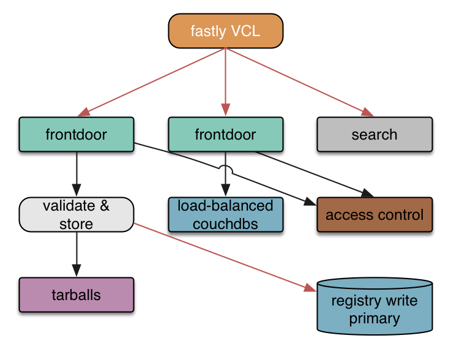
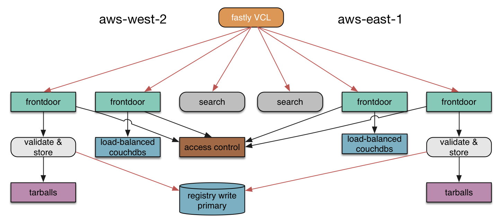

build-lists: true
# [fit] npm registry 2.0
# [fit] deep-dive

---

---

# [fit] registry 1.0
# [fit] embedded in couchdb

---

# [fit] javascript but not node

^ some support systems written in node

---

# advantages

* couchdb's replication is awesome
* didn't have to implement auth
* got away with storing package tarballs as couch attachments

---

# disadvantages

* all of this fell over at scale
* tarballs fell over first
* we aren't erlang experts

^ Base64-encoded binary blobs. Observability. Couch has a module system, but it isn't npm.  

---

# early 2014: stability

* pulled out tarballs
* put varnish in front of everything
* fastly CDN for geolocality

---

# [fit] end 2014: rewrite

---

# [fit] shipped the core of it
# [fit] as npm-enterprise
# [fit] "npm in a box" service

---

# [fit] had a working npm in node
# [fit] before we migrated the
# [fit] public registry to it

---

# [fit] live for more than a month

^ I teased this on twitter periodically. I would announce that "you're soaking in it" when new registry was live.

---

# [fit] turning on private modules
# [fit] was flipping a feature switch

^ This is how you want it to be.

---

# [fit] rewrite benefits

* future scaling
* ability to add features easily
* a use for our node expertise

---

# [fit] registry 2.0:
# [fit] lots of node

^ we just finished a big rewrite: now we're a node service

---

# [fit] yay microservices

---

^ Here's a pretty handwave-y block diagram of the registry. Each of these pieces is a scalable unit.

---

^ Hey look, I just made most of my system redundant across AWS, just by replicating the logical modules.

---

^ The real system diagram looks like this, but most of the time I don't need to think about it at this level. (If you want the details here, come to NodeConf OneShot on Saturday.)

---

# [fit] the stack (top)

* aws ec2
* ubuntu trusty
* mostly redundant across us east/west

^ Amazon! Everybody uses it. it's cheap. It give us lots of control. Ubuntu is the least annoying of the linux distros. I'd pick debian if it didn't exist. we have a couple single pts of failure.

---

# [fit] the stack (middle)

* haproxy for load balancing
* postgres for all other data
* redis for caching
* nginx for static files

---

# [fit] the dbs

* couchdb for package data storage
* postgres for users, billing, access control lists
* replica of the package data in postres to drive website

---

# [fit] node frameworks

* web site only: hapi
* everything else: restify

^ The public downloads service is hapi, but we'll rewrite that when we get around to making it perform well.

---

# node-restify

* simple
* barely a framework
* observable
* sinatra/express routing
* we like the connect middleware style

---

# configuration via etcd

## https://github.com/coreos/etcd

A highly available key/value store intended for config & service discovery. We recursively store & extract json blobs from it using `renv`.

^ How we do configuration.

---

# lots of complexity

* each piece has a well-defined responsibility
* each piece can be redundant
* exceptions: db write primaries

---

# conservatism won with node

* we're mostly on node 0.10.37
* memory leaks
* will try again with iojs 1.8.x
* or with node now that iojs is folded in :)

---

# git deploy

`git push origin branch:deploy-production`

That's it. You've deployed.

---

# A git-deployable service

- provisioned by ansible
- haproxy load-balancing & monitoring
- webhooks server
- github webhooks trigger a bash script
- any server can have many apps git-deployed to it

The components are all open-sourced.

---

# open sourced parts

* `jthooks`: run by ansible to set up github web hooks
* `jthoober`: a webhook server run on each box that listens for webhook pushes from github
* `rderby`: rolling restarts that stop when monitoring endpoints don't respond
* `renv`: recursively stores & reads json blobs from `etcd`.
* `ndm`: generate upstart/whatever scripts from a service.json config

---

# upsides

---

# downsides

* yay distributed systems
* backpressure isn't handled well
* some mysterious wedging
* everything is hand-rolled

---

# operational excitement

* We are still discovering the weak points.
* Every incident results in new alerts.
* Metrics are going to matter more to us.
* (This system is at least more observable than couchdb.)

---

# [fit] npm loves you
