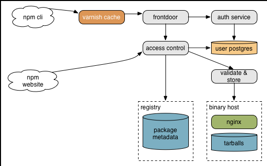

build-lists: true

# [fit] Cheating Gall's Law

---

## [fit] How we split
# [fit] a monolith
## [fit] and lived to tell the tale

---

# [fit] C J Silverio
## [fit] director of engineering, npm
## [fit] @ceejbot

^ Working at npm is a privilege.

---

^ npm like a lot of systems was originally very simple. The registry was a few thousand lines of javascript embedded inside CouchDB. Auth was couch's auth.

---

^ That is the very definition of a monolith.

---

# [fit] monolith
# [fit] everything in one process

---

# [fit] monoliths
# [fit] work just fine

---

# [fit] whatever it takes
# [fit] to get to your
# [fit] simple working system

^ It's far harder to make something that delights your users and is a viable product than it is to scale something after the fact. This is what npm did.

---

# [fit] scaling monoliths
# [fit] many copies of the full thing

^ After a while this becomes expensive. Your monolith is probably expensive.

---

# [fit] Exponential growth of node
# [fit] resulted in exponential growth
# [fit] of the npm registry

^ Eventually we needed to break out of that single app embedded inside couchdb.

---

# [fit] splitting the
# [fit] monolith

^ Eventually you need to scale differently: by improving sub-pieces of the monolith.

---

# [fit] yay microservices?

^ but there's a catch

---

# [fit] Your monolith is complex.
# [fit] A split system is complex.

^ Complexity is the enemy of everything.

---

# [fit] Gall's Law

# [fit] A complex system that works is
# [fit] invariably found to have evolved
# [fit] from a simple system that worked.

^ A complex system that works is invariably found to have evolved from a simple system that worked.

---

# [fit] Systemantics:
# [fit] How Systems Really Work
# [fit] and How They Fail

^ John Gall: who the dude was

---

# Gall's Law

> A complex system that works is invariably found to have evolved from a simple system that worked. A complex system designed from scratch never works and cannot be patched up to make it work. You have to start over with a working simple system.

^ A complex system that works is invariably found to have evolved from a simple system that worked. A complex system designed from scratch never works and cannot be patched up to make it work. You have to start over with a working simple system.

---

# [fit] "A simple system
# [fit] may or may not work."

^ That's really encouraging. Gall is just a bundle of fun here. But he's saying things we all already suspect.

---

# [fit] Gall's Law
# [fit] is in our way

^ The system we need to replicate is complicated. We can't just build it from scratch. We have some advantages here. We know what a working system looks like.

---

# [fit] Q: How do you cheat?

^ There are a lot of options here. I'm going to tell you the one npm took, because it's a networked service. If you're writing web services, this might work for you.

---

# [fit] Q: How do you cheat?
# [fit] A: With a proxy.

---

# [fit] rewrite piece by piece
# [fit] proxy to the new pieces

---

^ Varnish as a proxy: tarball reads go to nginx. Package metadata reads & writes go to couchdb. This simple technique was our first step to breaking up the monolith.

---

# [fit] Replace Varnish
# [fit] with a node service

^ You can put some logic into Varnish, but get a lot more mileage out of proxying at the application level. Observability!

---

^ We called it the registry frontdoor, because all traffic goes through it.

---

# [fit] just send everything through

^ Great time to measure. Metrics, logging, everything! For us, this was also a chance to find out what people were actually doing with the registry.

---

# [fit] start pulling pieces out
# [fit] and sending them to new services

---

^ Authorization & package validation are now pulled out of couch into services.

---

# [fit] each service is simple
# [fit] one concern each

^ Gall's Law is still in force. We still must write simple things & build from there. But

---

# [fit] modularity
# [fit] aka information hiding

^ You think about this at the code level, but here we're doing it at the service level.

---

# [fit] now you can change
# [fit] everything

^

---

# [fit] your platform
# [fit] your database

^ We went from js inside couchdb to js in node services. We also pulled data out of couchdb onto the file system and into postgres.

---

---

# [fit] Microservices &
# [fit] single-purpose databases.

---

^ The registry looks like this now.

---

# [fit] Nobody noticed this change.

^ 120 seconds of downtime during the rollout thanks to a surprise merge.

---

# [fit] Advantages

---

# [fit] Each piece is simple

^ More easily debugged & understood.

---

# [fit] Everything is now
# [fit] observable

^ Metrics & logging. Can scale by multiplication of a smaller piece. For us this was a huge win.

---

# [fit] modularity
# [fit] each piece hides implementation

^ Can change the user database without the rest of the system caring.

---

# [fit] pitfalls

^ There's always a tradeoff. Nothing ever comes free.

---

# [fit] now you've got a
# [fit] distributed system

^ You had one before but mostly you pretended you didn't because the hard parts were handled by somebody else. Now you have one that's entirely your responsibilty.

---

# @architectclippy says

> I see you have a poorly structured monolith. Would you like me to convert it into a poorly structured set of microservices?

^ Get it working, iterate & clean it up.

---

# [fit] faithfully preserved
# [fit] your mistakes? Doh.

^ We have done a bunch of this. Clean up where you can.

---

# [fit] Second system syndrome:
# [fit] this time we'll do it right

^ Doing it right usually means generalizing EVERYTHING because you just went through the pain of adding generalization here & there to a system that wasn't designed for it. Don't do it!

---

# [fit] Generalize only when forced

^ Even when you remember the pain you experienced generalizing that first system. Do it only when you must. Avoid complexity that doesn't pay for itself.

---

# [fit] Lessons learned

---

# [fit] build your working system first
# [fit] scale it later

^ Don't be ridiculous about scaling, but don't worry about it. You'll be able to afford it later if you've built something people want.

---

# [fit] simple first
# [fit] complex later

^ Be ruthless about this.

---

# [fit] proxies are cool.
# [fit] I'm into proxies now.

^ A proxy will let you divide & conquer.s

---

# [fit] npm loves you
